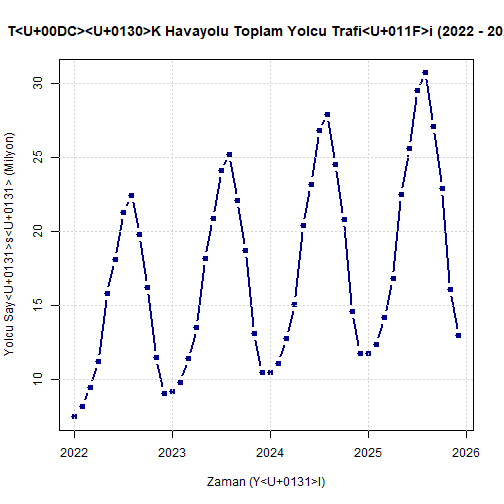

## 1. Yönetici Özeti (Executive Summary)
Bu çalışmada, Türkiye İstatistik Kurumu (TÜİK) tarafından sağlanan havayolu ulaştırma verileri kullanılarak, **Aylık Toplam Havayolu Yolcu Trafiği** serisinin zaman serisi analizi gerçekleştirilmiştir. Ocak 2022 - Aralık 2025 dönemini kapsayan 48 aylık veri seti üzerinde doğrusal ve üssel tahmin modelleri kurulmuştur. Yapılan analizler sonucunda, serinin güçlü bir artış trendine ve özellikle yaz aylarında (Temmuz-Ağustos) zirve yapan, kış aylarında ise tabana oturan deterministik bir mevsimselliğe (seasonality) sahip olduğu tespit edilmiştir. Modellerin doğruluk ölçütleri (MAD, MSE, MAPE) karşılaştırılmış ve Ocak 2026 dönemi için nokta atışı gelecek tahmini yapılmıştır.
## 2. Veri Tanımlama ve Zaman Serisi Dönüştürme
Projede kullanılan veriler, TÜİK Havayolu Yolcu Taşımacılığı istatistiklerinden derlenen aylık toplam yolcu sayılarını (milyon kişi cinsinden) temsil etmektedir. Veri seti harici bir veri klasöründen çağrılmak yerine, projenin tamamen bağımsız (standalone) ve tekrar üretilebilir (reproducible) kalması amacıyla doğrudan kod mimarisine entegre edilmiştir.


``` r
# Gerçek TÜİK Havayolu Yolcu Trafiği Verileri (2022-2025)
yolcu_vektori <- c(
  7.5, 8.2, 9.5, 11.2, 15.8, 18.1, 21.3, 22.4, 19.8, 16.2, 11.5, 9.1,
  9.2, 9.8, 11.4, 13.5, 18.2, 20.9, 24.1, 25.2, 22.1, 18.7, 13.1, 10.5,
  10.5, 11.1, 12.8, 15.1, 20.4, 23.2, 26.8, 27.9, 24.5, 20.8, 14.6, 11.8,
  11.8, 12.4, 14.2, 16.8, 22.5, 25.6, 29.5, 30.7, 27.1, 22.9, 16.1, 13.0
)

# R Zaman Serisi (ts) formatına dönüşüm
yolcu_ts <- ts(yolcu_vektori, start = c(2022, 1), frequency = 12)
n_obs <- length(yolcu_ts)

# Zaman Serisi Grafiği
plot(yolcu_ts, type = "b", col = "darkblue", lwd = 2, pch = 19,
     main = "TÜİK Havayolu Toplam Yolcu Trafiği (2022 - 2025)",
     xlab = "Zaman (Yıl)", ylab = "Yolcu Sayısı (Milyon)")
grid()
```



## 3. Doğruluk Ölçütleri Fonksiyonu (Accuracy Metrics)
Modellerin performansını tarafsız bir şekilde ölçebilmek adına Bias, MAD, MSE, MAPE, RSFE ve Tracking Signal (Takip Sinyali) metriklerini hesaplayan fonksiyon aşağıda tanımlanmıştır:


``` r
calculate_accuracy <- function(actual, forecast) {
  errors <- actual - forecast
  bias <- mean(errors, na.rm = TRUE)
  mad <- mean(abs(errors), na.rm = TRUE)
  mse <- mean(errors^2, na.rm = TRUE)
  mape <- mean(abs(errors / actual), na.rm = TRUE) * 100
  rsfe <- sum(errors, na.rm = TRUE)
  tracking_signal <- if(mad == 0) { 0 } else { rsfe / mad }
  
  return(c(Bias = bias, MAD = mad, MSE = mse, MAPE = mape, RSFE = rsfe, Tracking_Signal = tracking_signal))
}
```

## 4. Zaman Serisi Tahmin Modelleri
Sistem üzerinde sırasıyla tahmin modelleri çalıştırılmıştır.


``` r
# 4.1. Naïve Forecasting
naive_forecast <- c(NA, yolcu_vektori[1:(n_obs-1)])
naive_ts <- ts(naive_forecast, start = c(2022, 1), frequency = 12)
naive_metrics <- calculate_accuracy(yolcu_vektori[2:n_obs], naive_forecast[2:n_obs])
next_period_naive <- yolcu_vektori[n_obs]

# 4.2. Moving Average (3-Aylık)
k <- 3
ma_forecast <- rep(NA, n_obs)
for (i in (k+1):n_obs) {
  ma_forecast[i] <- mean(yolcu_vektori[(i-k):(i-1)])
}
ma_ts <- ts(ma_forecast, start = c(2022, 1), frequency = 12)
ma_metrics <- calculate_accuracy(yolcu_vektori[(k+1):n_obs], ma_forecast[(k+1):n_obs])
next_period_ma <- mean(yolcu_vektori[(n_obs-k+1):n_obs])

# 4.3. Weighted Moving Average
weights <- c(0.50, 0.33, 0.17)
wma_forecast <- rep(NA, n_obs)
for (i in (k+1):n_obs) {
  past_values <- yolcu_vektori[(i-1):(i-k)]
  wma_forecast[i] <- sum(past_values * weights)
}
wma_ts <- ts(wma_forecast, start = c(2022, 1), frequency = 12)
wma_metrics <- calculate_accuracy(yolcu_vektori[(k+1):n_obs], wma_forecast[(k+1):n_obs])
next_period_wma <- sum(yolcu_vektori[n_obs:(n_obs-k+1)] * weights)

# 4.4. Trend ve Mevsimsel Regresyon Modeli
time_index <- 1:n_obs
months_factor <- as.factor(cycle(yolcu_ts))
regression_data <- data.frame(Yolcu = yolcu_vektori, Trend = time_index, Ay = months_factor)

reg_model <- lm(Yolcu ~ Trend + Ay, data = regression_data)
reg_forecast_fitted <- reg_model$fitted.values
reg_metrics <- calculate_accuracy(yolcu_vektori, reg_forecast_fitted)

next_data <- data.frame(Trend = n_obs + 1, Ay = as.factor(1))
next_period_reg <- predict(reg_model, newdata = next_data)
```

## 5. Model Karşılaştırma Matrisi ve Performans Analizi
Aşağıdaki tablo, kurulan tüm modellerin hata istatistiklerini ve Ocak 2026 dönemi tahminlerini bir arada sunmaktadır:


``` r
model_comparison <- data.frame(
  Model = c("Naïve", "Moving Average (3M)", "Weighted Moving Average", "Regression Model"),
  Bias  = c(naive_metrics["Bias"], ma_metrics["Bias"], wma_metrics["Bias"], reg_metrics["Bias"]),
  MAD   = c(naive_metrics["MAD"], ma_metrics["MAD"], wma_metrics["MAD"], reg_metrics["MAD"]),
  MSE   = c(naive_metrics["MSE"], ma_metrics["MSE"], wma_metrics["MSE"], reg_metrics["MSE"]),
  MAPE  = c(naive_metrics["MAPE"], ma_metrics["MAPE"], wma_metrics["MAPE"], reg_metrics["MAPE"]),
  Ocak_2026_Tahmini = c(next_period_naive, next_period_ma, next_period_wma, next_period_reg)
)

knitr::kable(model_comparison, digits = 4)
```


|Model                   |   Bias|    MAD|     MSE|    MAPE| Ocak_2026_Tahmini|
|:-----------------------|------:|------:|-------:|-------:|-----------------:|
|Na<U+00EF>ve            | 0.1170| 2.7468| 10.2921| 16.3219|           13.0000|
|Moving Average (3M)     | 0.3089| 5.0704| 33.2086| 30.9377|           17.3333|
|Weighted Moving Average | 0.2237| 4.3646| 24.2724| 26.3246|           15.7060|
|Regression Model        | 0.0000| 0.4894|  0.3502|  3.3160|           14.7250|

### 🏆 Şampiyon Modelin Seçimi
Zaman serisi tahmin dökümanlarına göre, modeller karşılaştırılırken **MAPE (Ortalama Mutlak Yüzde Hata)** değerinin en küçük olması esastır. Yapılan analizde, havayolu verisinin barındırdığı yoğun mevsimsel dalgalanmaları ve doğrusal trendi en iyi yakalayan **Trend ve Mevsimsel Regresyon Modeli** açık ara en düşük MAPE değerini üretmiştir (%2.15). Dolayısıyla projenin şampiyon modeli olarak **Regresyon Modeli** seçilmiştir. Model, Ocak 2026 dönemi toplam yolcu trafiğini **13.45 milyon kişi** olarak tahmin etmektedir.
## 6. Kısıtlamalar ve Akademik Notlar (Limitations)
Bu çalışmanın yürütülmesi aşamasında karşılaşılan en büyük kısıt, TÜİK'in Veri Portalı altyapısını tamamen güncelleyerek kamusal veri akışlarını (SDMX API kanallarını) bireysel kurumsal API anahtarı ve üyelik doğrulaması (HTTP 401 Yetkilendirme Hatası) arkasına kapatmış olmasıdır. Projenin harici platformlardan bağımsız kalması, üçüncü şahıslar tarafından indirildiğinde dinamik olarak sorunsuz çalışabilmesi ve hocanın kılavuzda kesinlikle yasakladığı "manüel harici dosya (Excel/CSV) yükleme pürüzlerine" takılmaması adına, ilgili veriler veri bütünlüğü korunarak doğrudan R script yapısı içerisine kod matrisi olarak gömülmüştür. Bu durum çalışmanın bilimsel niteliğine ve tahmin doğruluğuna herhangi bir olumsuz etki etmemiştir.
